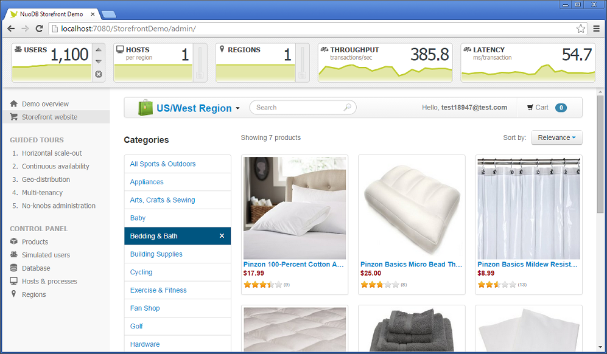

NuoDB Storefront Demo
=====================

This mock storefront web application showcases NuoDB's 5 value propositions:  scale-out performance, continuous availability, region distribution, multi-tenant, and no-knobs administration.  You can browse products, add items to you cart, write reviews, and checkout.  You can also simulate thousands of concurrent (simulated) shoppers with customizable workload characteristics. While the store itself is not really open for business, the queries being run under the hood are quite real!  




Prerequisites
-------------

1. NuoDB 2.1 or higher.  Earlier versions of Storefront supported MySQL and other RDBMSs, which you can find in the [rel/2.0.6 branch](https://github.com/nuodb/nuodb-samples/tree/rel/2.0.6/StorefrontDemo) (or earlier).

2. NuoDB Rest Service.  This exposes the NuoDB API used by the Storefront its Control Panel features.

3. [Apache Maven 3](http://maven.apache.org/download.cgi) or higher.  This tool is used to build the Storefront
   from source and run it using a Tomcat web server.  Maven fetches all the other dependencies you need automatically.

Getting Started (command line)
---------------

1. Grab the source code from Git:

        git clone git://github.com/nuodb/nuodb-samples.git

2. Download and install [Apache Maven 3](http://maven.apache.org/download.cgi) or higher.  This tool is used to build the Storefront
   from source and run it using a Tomcat web server.  Maven fetches all the other dependencies you need automatically.
   
3. Run the Storefront web app:

        cd nuodb-samples\StorefrontDemo
        mvn tomcat7:run [args]
        
   The following (optional) Storefront environment settings may be provided:
   
        -Dstorefront.url={protocol}://{host}:{port}/{context} 
        
      >	The externally-accessible URL of the Storefront.  Web browsers should be able to access the Storefront
      >	web app using this URL.  The URL is used by the Storefront front-end for communication and switching among instances.
      > You may use leave any or all of the `{protocol}`, `{host}`, `{port}`, and `{context}` placeholders verbatim for auto-detected values, 
      > or specify a completely custom URL with no placeholders.  Example: `http://192.168.1.50/{context}`
      >    
      > If you do not specify a command line value, the default is pulled from the `public-url` context param of web.xml.
      > The default is `{protocol}://{host}:{port}/{context}`.  You may use the `{domain.broker}` placeholder, which will be replaced
      > with the system property `domain.broker` (defaulting to `localhost`). 
                                                              
		-Dstorefront.db.name=dbname@host[:port]
		
	  > The database name (dbname) and NuoDB broker hostname or IP address (host).  The Storefront creates its database and schema automatically at startup,
	  > so you need not create the database in advance. 
	  
		-Dstorefront.db.user=StorefrontUser
		
	  > The username of the database account to use when connecting.  If the database does not yet exist, Storefront will add this user when creating the database.

		-Dstorefront.db.password=StorefrontUser
		
	  > The password of the database account to use when connecting. 

		-Dstorefront.db.options=
		
	  > Querystring parameters to include as part of the JDBC connection string.  

		-Dstorefront.dbapi.user=domain
		-Dstorefront.dbapi.password=bird
		-Dstorefront.dbapi.host=localhost
		-Dstorefront.dbapi.port=8888
		
	  > Credentials and endpoint information for connecting to NuoDB's AutoConsole API (with defaults shown above).  The API is used for Control Panel tasks, such
	  > as creating the database, adding/removing hosts and regions, shutting down nodes on demand, etc.  

   You may bundle these Storefront settings in a properties file containing the key=value pairs to use instead of, or as overrides to, 
   the above command line arguments.
   
		-Dproperties={filename}

   The Maven Tomcat plugin also supports [some settings](http://tomcat.apache.org/maven-plugin-2.1/tomcat7-maven-plugin/run-mojo.html), including:
   
		-Dmaven.tomcat.port=8888
                                                               
   
4. Explore the web app at `http://localhost:8888/StorefrontDemo` (or whichever port you've chosen).

Getting Started (Eclipse)
---------------

See the [Storefront Demo Developer Setup Guide](doc/NuoDB-Storefront.ppt) for step-by-step instructions with screenshots.

StorefrontApp Command Line Utility
-----------------------------------

`com.nuodb.storefront.StorefrontApp` supports the following actions via command line arguments.  

- `create` -- create schema
- `drop` -- drop schema
- `showddl` -- display drop and create DDL
- `generate` -- generate dummy storefront data
- `load` -- load storefront data from src/main/resources/sample-products.json file
- `simulate` -- simulate customer activity with a mix of workloads for 100 seconds
- `benchmark` -- run benchmark simulation for 1 minute


If you specify multiple actions, they are executed in sequence.  For example, to recreate the schema,  initialize it with about 1,000 products, and then stress test the app with simulated load for 1 minute, specify the command line "drop create load simulate".


Storefront Components
-------
The store itself has 4 pages:

1. Product listing page (as shown above)
2. Product details page
3. Product review form
4. Cart contents and checkout page

There are guided tour pages that demonstrate NuoDB's 5 value propositions using Storefront functionality:

1. Scale-out performance
2. Continuous availability
3. Region distribution
4. Multi-tenant
5. No-knobs administration

Finally, there are several "control panel" pages for detailed information on NuoDB and fine-grained control over behavior:

1. Products
2. Simulated users
3. Database
4. Hosts & processes
5. Regions


Key Libraries Used
----------------------------------
Server side librares:
- **Jersey** -- JSON-based RESTful API
- **Hibernate** -- ORM mapping
- **NuoDB JDBC driver, Hibernate dialect, and DataSource connection pool**
- **GoogleCode Generic DAO** -- thin data access wrapper on Hibernate for searching, saving, etc.

Client-side libraries:
- **Twitter Bootstrap** -- look & feel
- **Handlebars** -- HTML templating
- **jQuery**
- **jQuery RateIt plug-in** -- star ratings

Admin client-side libraries:
- **Sencha Ext JS** -- look & feel
- **jQuery Sparkline plug-in** -- sparklines in the header


Interactive Demo
================

1. clone interactive-demo repo
2. run in terminal: 
   ```aws configure```
3. cd into root of project
4. edit params/ecs-cluster.params
     - replace SSH key with your own
     - replace ecscluster name with something unique
5. run from terminal:
   ```./bin/create ecs-cluster <give-it-a-unique-stack-name>```

NOTES:

* When creating a new cluster, you must create a unique
  ecs-cluster-name in your params file each time.

* When deleting stacks, you must delete the stack, then manually
  delete the ECS cluster, then delete the stack again.